# Sleeping Dragon Hobby Shop

![Image]

### [See live site.](https://sleeping-dragon-hobby-shop.herokuapp.com/)

Assessor test account credentials:

Username: testerAccount
Password: xS39c9Tmnk=RTv3m

Assessor superuser test account credentials:

Username: testAdmin
Password: Jvw3ZuuFpqNL4qvb

## Table of Contents

> -	[Overview](#overview)
> -	[Description](#description)
> -	[UX](#ux)
> -	[Features](#features)
> -	[Technologies Used](#technologies-used)
> -	[Testing](#testing)
> - [Deployment](#deployment)
> -	[Credits](#credits)
> - [Acknowledgements](#acknowledgements)

## Overview

Sleeping Dragon Hobby Shop is an e-commerce store for an existing company selling modelling and hobby supplies for wargaming, intended to replace the [current online presence](https://www.sleepingdragonhobbyshop.co.uk/) with a new web application. It also aims to reduce the company's reliance on third-party apps/plugins for site design and store management by providing internal control of those elements to site super users.  

## Description

Sleeping Dragon Hobby Shop is an e-commerce store built using the Django/Python full stack MVC framework and related technologies. It uses a relational data model and application features to implement the required business logic, and allows relational data to be managed, queried and manipulated in order to meet the needs of the site users.

## Target Audience

The target audience for Sleeping Dragon Hobby Shop are consumers looking to purchase scenic modelling and hobby supplies aimed at wargamers, role-players and tabletop gamers. The site aims to meet the shopping needs of hobbyists of all stripes, by offering products from a number of well-known brands, a wide range of materials, and extensive product details to allow users to make informed purchases.

## Business Objectives

* Provide a high-quality, well-designed online shop that enables secure purchases, inspires confidence in the quality of the product and service, and encourages repeat purchases.
* Grow the brand over time, and expand to new ranges and products
* Listen and respond to customer feedback to guide product expansion
* Track sales data to inform future business strategy

## User Objectives
* Purchase high quality modelling supplies
* See other user's reviews and feedback to inspire confidence in making a purchase
* Review and recommend products
* Contact the business about products and orders
* Have a personalised profile to enable quicker, smoother purchasing

## User Experience (UX)

### User stories
**User classes:**

- Site User - General user
- Shopper - A user wishing to purchase products
- Store Owner - Site super user

<table>
    <tr>
        <th>STORY ID</th>
        <th>AS A</th>
        <th>I WANT TO BE ABLE TO</th>
        <th>SO THAT I CAN</th>
    </tr>
    <tr>
        <td colspan="4"><b>Viewing and Navigation</b></td>
    </tr>
    <tr>
        <td>US01</td>	
        <td>Shopper</td>	
        <td>View a list of products</td>	
        <td>Select some to purchase</td>
    </tr>
    <tr>
        <td>US02</td>
        <td>Shopper</td>
        <td>View a specific category of products</td>
        <td>Quickly find products I'm interested in without having to search through all products</td>
    </tr>	
    <tr>
        <td>US03</td>
        <td>Shopper</td>
        <td>View individual product details</td>
        <td>Identify the price, description, product rating and product image</td>
    </tr>
    <tr>
        <td>US04</td>
        <td>Shopper</td>
        <td>Easily view the total of my purchases at any time</td>
        <td>Avoid spending too much</td>
    </tr>
    <tr>
        <td colspan="4"><b>Registration and User Accounts</b></td>
    </tr>
    <tr>
        <td>US05</td>
        <td>Site User</td>
        <td>Register for an account</td>
        <td>Have a personal account and be able to view my profile</td>
    </tr>
    <tr>
        <td>US06</td>
        <td>Site User</td>
        <td>Login or logout</td>
        <td>Access my personal account information</td>
    </tr>
    <tr>
        <td>US07</td>
        <td>Site User</td>
        <td>Reset my password</td>
        <td>Recover access to my account</td>
    </tr>
    <tr>
        <td>US08</td>
        <td>Site User</td>
        <td>Receive an email confirmation after registering</td>
        <td>Verify that my account registration was successful</td>
    </tr>
    <tr>
        <td>US09</td>
        <td>Site User</td>
        <td>Have a personalised user profile</td>
        <td>View my personal order history and order confirmatons, and save my payment information</td>
    </tr>
    <tr>
        <td>US10</td>
        <td>Site User</td>
        <td>Login using a social media account</td>
        <td>Quickly access my account using social media credentials with one click</td>
    </tr>
    <tr>
        <td colspan="4"><b>Sorting and Searching</b></td>
    </tr>
    <tr>
        <td>US11</td>
        <td>Shopper</td>
        <td>Sort the list of available products</td>
        <td>Easily identify the best rated, best priced and categorically sorted products</td>
    </tr>
    <tr>
        <td>US12</td>
        <td>Shopper</td>
        <td>Sort a specific category of products</td>
        <td>Find the best priced or best rated product in a specific category, or sort products in that category by name</td>
    </tr>
    <tr>
        <td>US13</td>
        <td>Shopper</td>
        <td>Sort multiple categories of products simultaneously</td>
        <td>Find the best priced or best rated products across broad categories, such as "paints" or "materials"</td>
    </tr>
    <tr>
        <td>US14</td>
        <td>Shopper</td>
        <td>Sort products by specific brands</td>
        <td>Find all products from a particular brand or manufacturer</td>
    </tr>
    <tr>
        <td>US15</td>
        <td>Shopper</td>
        <td>Search for a product by name or description</td>
        <td>Find a specific product I'd like to purchase</td>
    </tr>
    <tr>
        <td>US16</td>
        <td>Shopper</td>
        <td>Easily see what I've searched for and the number of results</td>
        <td>Quickly decide whether the product I want is available</td>
    </tr>
    <tr>
        <td colspan="4"><b>Purchasing and Checkout</b></td>
    </tr>
    <tr>
        <td>US17</td>
        <td>Shopper</td>
        <td>View items in my cart to be purchased</td>
        <td>Identify the total cost of my purchase and all items I will receive</td>
    </tr>
    <tr>
        <td>US18</td>
        <td>Shopper</td>
        <td>Adjust the quantity of individual items in my cart</td>
        <td>Easily make changes to my purchase before checkout</td>
    </tr>
    <tr>
        <td>US19</td>
        <td>Shopper</td>
        <td>Easily enter my payment information</td>
        <td>Checkout quickly and with no hassle</td>
    </tr>
    <tr>
        <td>US20</td>
        <td>Shopper</td>
        <td>Feel my personal and payment information is safe and secure</td>
        <td>Confidently provide the needed information to make a purchase</td>
    </tr>
    <tr>
        <td>US21</td>
        <td>Shopper</td>
        <td>View an order confirmation after checkout</td>
        <td>Verify that I haven't made any mistakes</td>
    </tr>
    <tr>
        <td>US22</td>
        <td>Shopper</td>
        <td>Receive an email confirmation after checkout out</td>
        <td>Keep the confirmation of what I've purchase for my records</td>
    </tr>
    <tr>
        <td colspan="4"><b>Sales and Reports</b></td>
    </tr>
    <tr>
        <td>US23</td>
        <td>Store Owner</td>
        <td>Get sales reports</td>
        <td>See individual orders and sales totals over time</td>
    </tr>
    <tr>
        <td>US24</td>
        <td>Store Owner</td>
        <td>Get product reports</td>
        <td>See product sales and manage stock levels</td>
    </tr>
    <tr>
        <td>US25</td>
        <td>Store Owner</td>
        <td>Search for individual orders by name or unique ID</td>
        <td>Verify order information</td>
    </tr>
    <tr>
        <td colspan="4"><b>Admin and Store Management</b></td>
    </tr>
    <tr>
        <td>US26</td>
        <td>Store Owner</td>
        <td>Add a product or category</td>
        <td>Add new items or categories to my store</td>
    </tr>
    <tr>
        <td>US27</td>
        <td>Store Owner</td>
        <td>Edit/Update a product or category</td>
        <td>Change product prices, descriptions, images and other product criteria</td>
    </tr>
    <tr>
        <td>US28</td>
        <td>Store Owner</td>
        <td>Delete a product or category</td>
        <td>Remove items that are no longer for sale</td>
    </tr>
</table>


## Structure

<details><summary><b>Data Structure</b></summary>

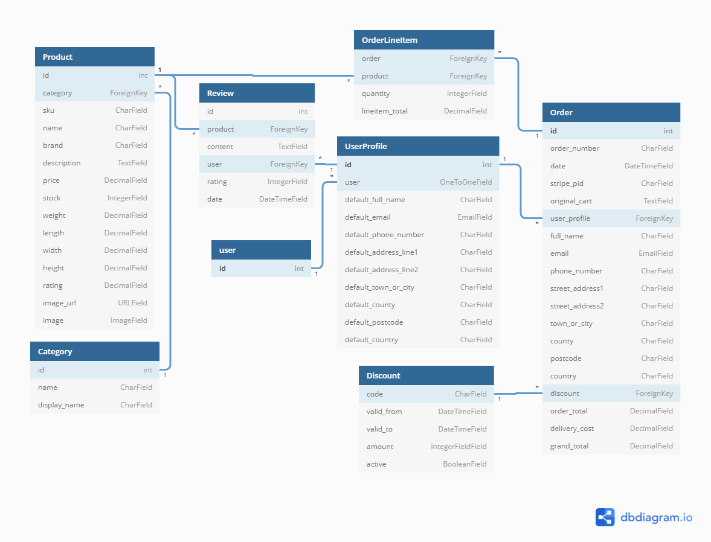

</details>

## Skeleton

The company's existing site can be found [here](https://www.sleepingdragonhobbyshop.co.uk/). The current site is implemented with Wordpress and as such is restricted to utilising Wordpress themes, with limited customisation available. The site is now starting to appear dated, and in general the styling is becoming unsuitable for a modern ecommerce application.

### Home Page

The home page is used to used to introduce the site with a welcome message and prominent call-to-action button, as well as a colourful background that sets the overall tone for the site. The 'Shop Now' button redirects users to the all products view, while the navbar allows users to navigate to specific areas of the site.

<details><summary><b>Wireframe</b></summary>

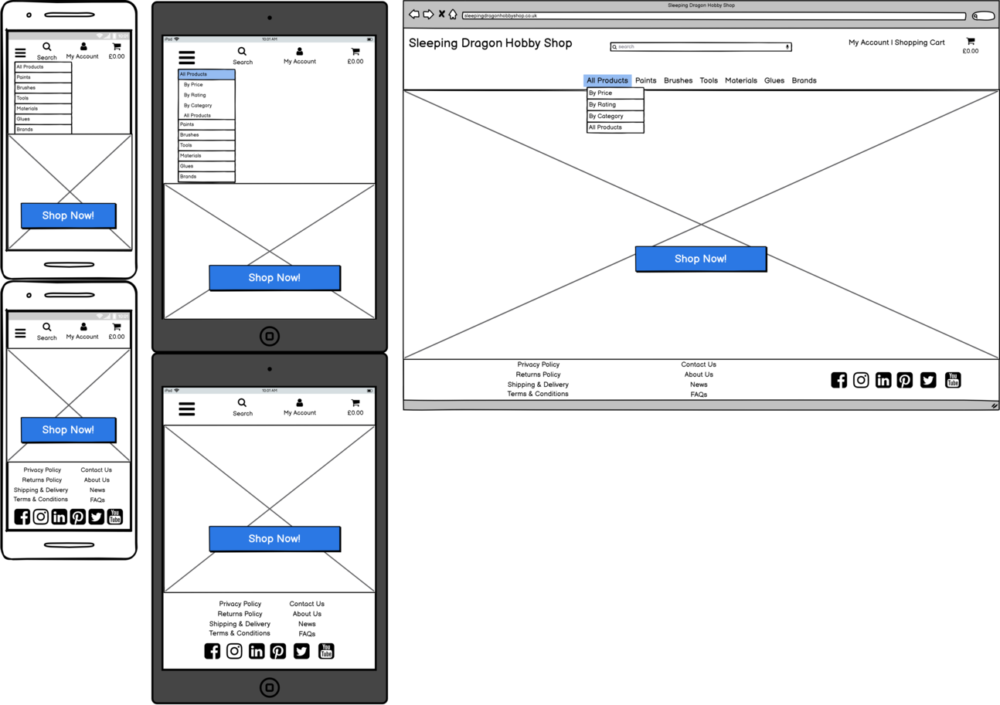

</details> 

### Products Page

The Products page displays all the products available on the site, and forms the basis of the category pages, allowing users to view specific categories of product. The sort selector allows users to further order products to their preference e.g. alphabetically, by price, by rating etc. Each product has an individual 'Add to Cart' button to allow users to quickly add items to their shopping cart without having to click through to individual product pages. 

<details><summary><b>Wireframe</b></summary>

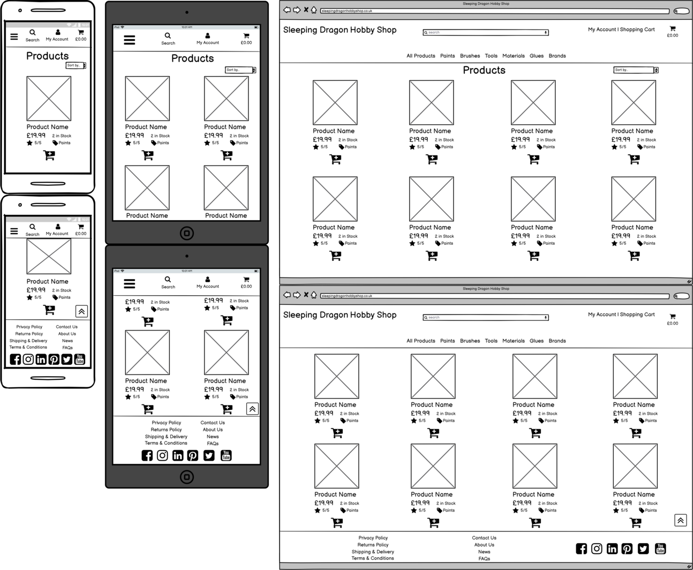

</details> 

### Product Detail Page

The Product Detail page displays full information about each individual product, and allows users to add specific quantities of an item to their shopping cart. 

<details><summary><b>Wireframe</b></summary>


</details>  

### Single Category Page

The Single Category page displays all products in a specific shop category. The specific category is displayed as a rounded pill button below the Products header, to allow ease of navigation for users. 

<details><summary><b>Wireframe</b></summary>

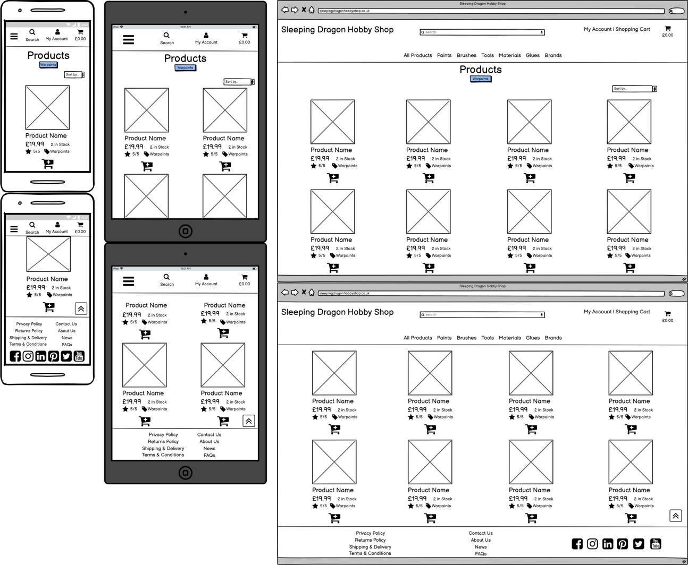

</details> 

### Multi-Category Page

The Multi-Category page displays each category within a product menu (e.g. 'Paints') to allow users to easily navigate through the other categories within that product menu, with the current category highlighted for ease of navigation.

<details><summary><b>Wireframe</b></summary>

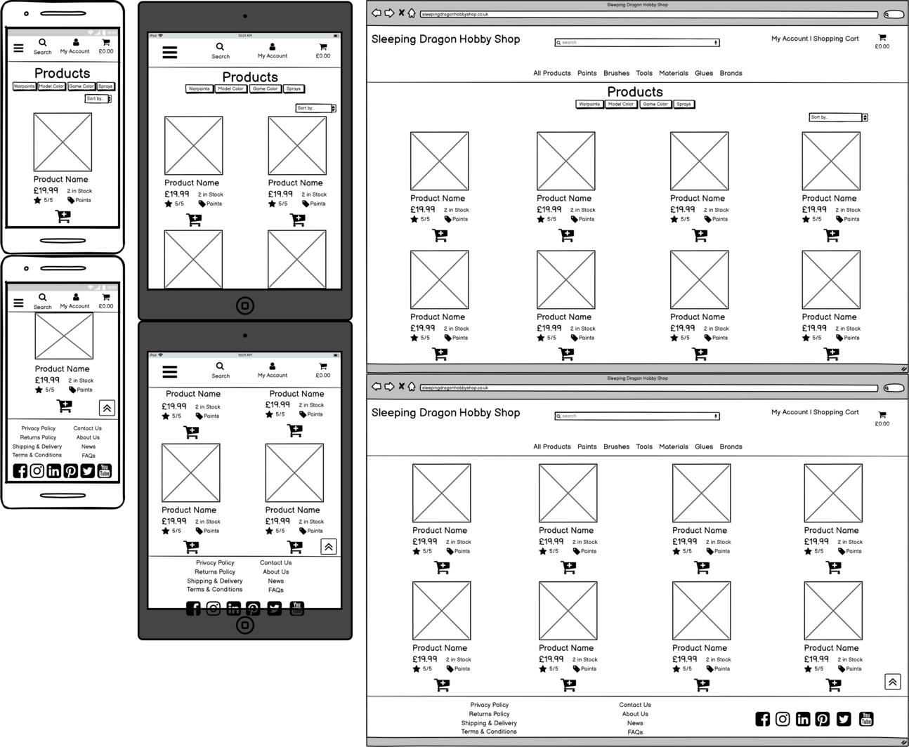

</details> 

### Shopping Cart Page

The Shopping Cart page displays the details of the products currently in the user's cart. Users can freely adjust quantities and products in their cart before committing to checkout.

<details><summary><b>Wireframe</b></summary>

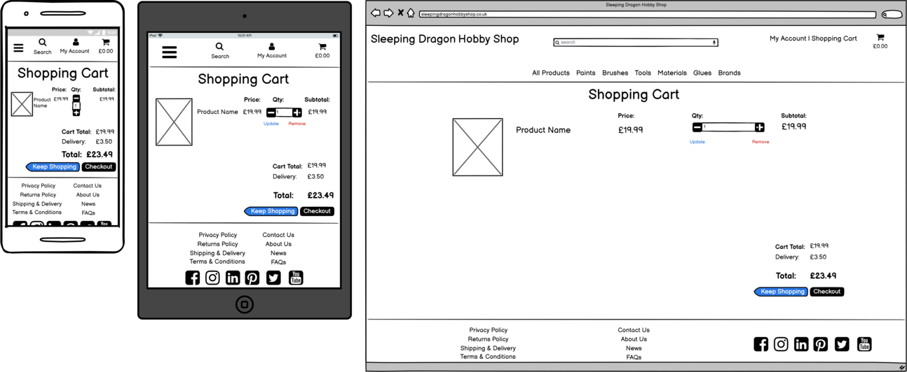

</details>   

### Checkout Page

The Checkout page presents a condensed version of the order summary, similar to the shopping cart page, as well as the order form and payment elements. The 'Edit Order' button ('Adjust Cart' in the final site) allows users to return to adjust their cart further, while the 'Complete Order' button validates the order and payment details and completes the purchase. 

<details><summary><b>Wireframe</b></summary>

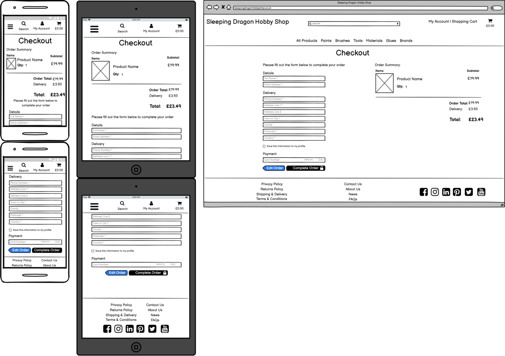

</details>   

### Order Confirmation Page

The Order Confirmation page displays the details of the completed order, including the user's delivery and billing information as well as the items purchased.

<details><summary><b>Wireframe</b></summary>

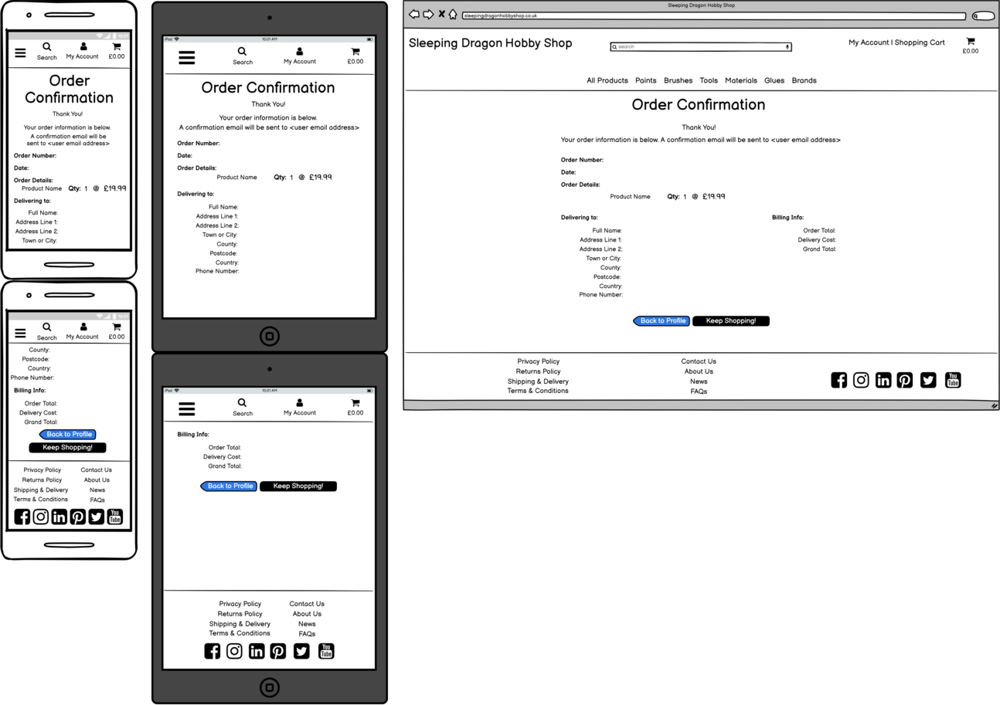

</details>   

### Profile Page

The Profile page allows a registered user to access their order history and save their default delivery information to speed up future checkouts, as well as change their password.

<details><summary><b>Wireframe</b></summary>

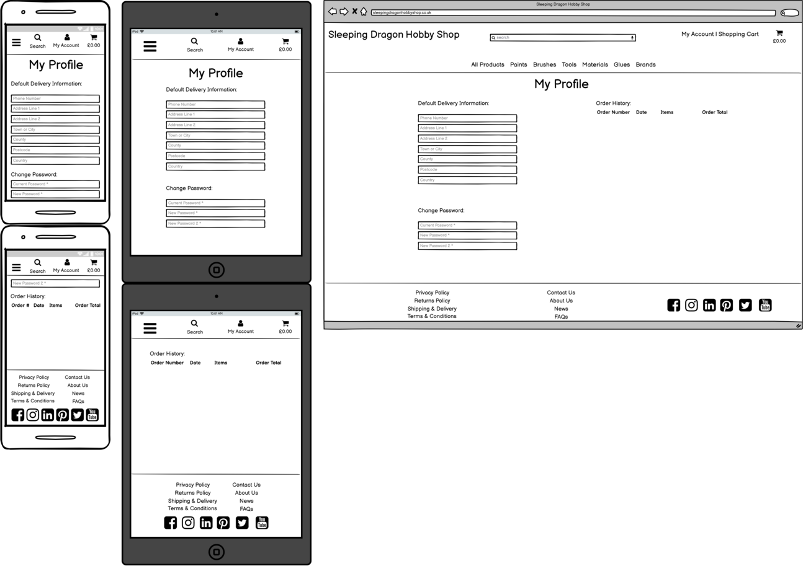

</details>  

### Login Page

The Login page allows registered users to login using their username and password. 

<details><summary><b>Wireframe</b></summary>

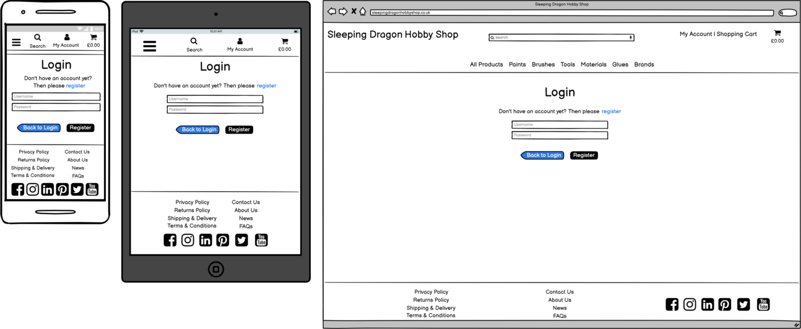

</details> 

### Register Page

The Register page allows unregistered users to create an account and access further features of the site.

<details><summary><b>Wireframe</b></summary>

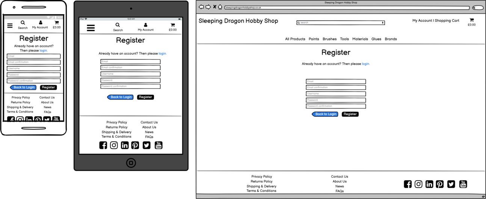

</details>  


## Surface

### Images

* The home page background image is by [Pawel Czerwinski](https://unsplash.com/@pawel_czerwinski?utm_source=unsplash&utm_medium=referral&utm_content=creditCopyText) on [Unsplash](https://unsplash.com/s/photos/paint-minimal-background?utm_source=unsplash&utm_medium=referral&utm_content=creditCopyText), rotated 90 degrees anti-clockwise to serve as a landscape background with the "swirl" moving from top-left to bottom-right in order to fit the initial vision for the home page design. The bright pink adds another accent colour to catch the user's attention, while the blue and off-white match the overall colour scheme of the site. The swirls of colour also add a visual connection to the site's purpose (i.e. selling paints)

* Product images are taken from the [existing company site](https://www.sleepingdragonhobbyshop.co.uk/), and used with permission from the respective manufacturers as established trade account holders. 

### Colours

Colours were largely chosen to present a clean, easily-navigated, professional storefront, with nods to the [existing company site](https://www.sleepingdragonhobbyshop.co.uk/). Rich Black provides the main font colour and 'confirmation' button colour. Cultured Grey provides the main off-white background colour, to match the colour of the homepage background image. White is used where appropriate as a font colour and button colour. Green Blue Crayola is the main accent colour, used for buttons, highlight text and the shop delivery banner background. Dark Cornflower Blue is used as a complimentary colour to the main brand blue, used for hover effects and occasional font colour.

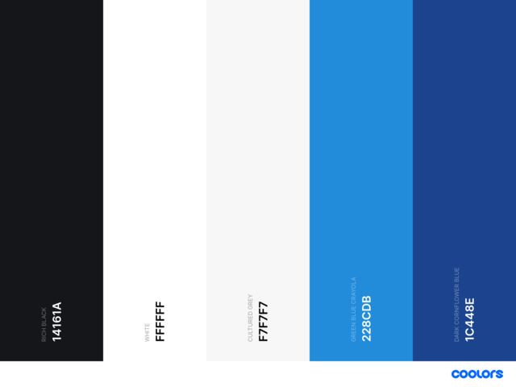

* Rich Black (#14161A)
* White (#FFFFFF)
* Cultured Grey (#F7F7F7)
* Green Blue Crayola (#228CDB)
* Dark Cornflower Blue (#1C448E)

### Typography

[Lato](https://fonts.google.com/specimen/Lato?query=Lato) was chosen as the main title font, as it is easily legible and is similar to the company's existing typography. [Libre Franklin](https://fonts.google.com/specimen/Libre+Franklin?query=Libre+Franklin) was chosen for the main content font, as it is easy to read, has plenty of styling options and complements Lato well. 

### Icons

Appropriate icons across the site were taken from [Font Awesome](https://fontawesome.com/). These add important visual cues for users, especially on mobile devices. 

## Features

The site allows admin users to add, edit, and delete products and product categories. It provides normal users with the functionality to search products by name or description, or browse products by category through a main navbar. Users can also sort products by price, rating, name or category. Products can be added to a user's shopping cart so long as there is stock available, and products in the cart can then be updated or removed before being purchased through a secure payment system backed by Stripe. Users are also able to apply discount codes to their shopping cart, if they have one available. Once payment is confirmed products are removed from stock levels and orders are created in the database. Successful checkout will generate an order confirmation email to the user's provided email address, and the user can view their order history through their personalised profile, should they decide to register an account. Registered users have the ability to add product reviews and ratings, and edit and delete their existing reviews. 

### Existing Features

#### Viewing and Navigation
* (US01): Products displayed on variety of product pages, sortable by category 
* (US02): Each product has a details page with detailed product information
* (US03): Shopping cart total is displayed on all pages, shopping cart toast displays total when products added to cart

#### Registration and User Accounts
* (US04): Users can register accounts through allauth
    - The site restricts information shown to users based on whether they are unregistered, registered, or admin
    - Some site routes block access to non-admin users
* (US05): The site uses django and allauth secure logins and access restrictions
    - The site enforces the use of HTTPS to ensure user communications and data are transmitted securely
    - Passwords are stored in hashed form so can't be stolen even if the website were to be hacked
* (US06): Allauth offers password resetting routes and links
* (US07): Allauth automatically sends confirmation emails to newly registered users' email addresses
* (US08): Users have a personal user profile which can store some basic checkout information and provides links to their past orders

#### Sorting and Searching
* (US10): Products can be viewed by rating, price and category from the main navbar, or on category pages via the sort selector
* (US11): Products can be viewed in categories from the main navbar, and sorted using the sort selector on each page
* (US12): Products can be viewed in multiple categories from the main navbar (e.g. 'All Paints', 'All Materials') and sorted via the sort selector 
* (US13): Products can be viewed by brand from the main navbar
* (US14): Products can be searched by name or description
* (US15): Product search results are shown with the product count and search term displayed alongside the results

#### Purchasing and Checkout
* (US16): Shopping Cart page displays full list of cart items and costs, shopping cart toast message displays cart when product added
* (US17): Products in the cart can have their quantity increased or decreased, or deleted entirely
    - Adjusting quantity also requires clicking an update button
    - Update and remove buttons are separated in the UI to prevent mistakenly clicking the wrong button
* (US18): On checkout users are presented with a simple validated form to enter personal and payment information, with registered users able to save personal information to their profile to pre-fill the form for even quicker checkout
* (US19): Checkout is supported by the secure Stripe payment platform
* (US20): After checkout a checkout success page is generated, giving the user details of their order items, delivery info and billing info
* (US21): After checkout an email is generated with the order information

#### Admin and Store Management
* (US25): Product Management page (admin only) allows admin to create new products or categories
* (US26): Individual products can be edited by admin users from all product pages, or from individual product detail pages
    - Categories can be edited from Product Management page
* (US27): Admin users can delete individual products from all product pages, or from individual product detail pages
    - Admin users can delete categories from Product Management page
    - To ensure products aren't deleted accidentally, when delete button is pressed a modal is shown asking the usre to confirm
    
### Features Left to Implement

#### Registration and User Accounts
* (US09): Social account login is not yet implemented

#### Sales and Reports
* (US22): Sales and Reports back-end is not yet implemented
    - Admin users can currently view the latest half-dozen orders in the Product Management page
    - Full functionality would allow admin users to view all orders in a separate page
    - Orders would be searchable, and sortable by date 
* (US23): Sales and Reports back-end is not yet implemented
    Planned Features:
    - Full Product list, searchable and sortable by name, SKU, stock, price and category
    - Full Product sales data, with filters for time period (e.g. Today, Last 7 Days, This Month etc.) 
    - Further filters to view category sales, or specific brands
    - Financial data allowing admin users to view sales totals over time, as well as discounts used and potentially tax calculations.
* (US24): Sales and Reports back-end is not yet implemented
    - Full functionality would allow admin users to view all orders in a separate page
    - Orders would be searchable, and sortable by date

#### Other
* Currently, site policies and pages linked in the **Footer** element simply redirect back to the homepage. These policies would be beneficial to add in an active business application, but for the scope of this project they add no current value and thus have not been implemented. 

* As noted in [TESTING.md](TESTING.md), if the site were to develop into an active business application, the issue of product images would need to be addressed. Using a HTTP/2 server, establishing long-term caching for static files and converting images to WebP format would greatly improve site performance. 

## Technologies Used

#### Languages:
* [HTML](https://en.wikipedia.org/wiki/HTML)
* [CSS](https://en.wikipedia.org/wiki/CSS)
* [JavaScript](https://en.wikipedia.org/wiki/JavaScript)
* [Python](https://en.wikipedia.org/wiki/Python_(programming_language))

#### Database 
* Development - [SQLite](https://docs.djangoproject.com/en/3.2/ref/databases/#sqlite-notes)
* Deployed site - [Heroku PostgreSQL](https://www.heroku.com/postgres)

#### Storage 
* [Amazon AWS S3](https://aws.amazon.com/) - used to store static files.

#### Payments 
* [Stripe](https://stripe.com/docs/api) - fully integrated payments platform.

#### Libraries & Frameworks:
* [Django](https://en.wikipedia.org/wiki/Django_(web_framework))
* [Balsamiq](https://balsamiq.com/) - Used for the creation of wireframes.
* [FontAwesome](https://fontawesome.com/) - Used for all site icons.
* [dbdiagram.io](https://dbdiagram.io/home) - Used to map out data structure. 
* [JQuery](https://jquery.com) - The project uses JQuery to simplify DOM manipulation.
* [GoogleFonts](https://fonts.google.com/) - 'Syncopate' and 'Raleway' fonts.
* [Bootstrap v5.0](https://getbootstrap.com/) - A mobile-first responsive library used to construct various parts of the project
* [Popper](https://popper.js.org/) - Included as a requirement of Bootstrap.
* [django-allauth](https://django-allauth.readthedocs.io/en/latest/index.html) - Used for user authentication
* [boto3](https://boto3.amazonaws.com/v1/documentation/api/latest/index.html) - **Amazon Web Services SDK** for python. Used to configure **Amazon Web Services S3** storage of static files.
* [django-crispy-forms](https://django-crispy-forms.readthedocs.io/en/latest/) - enables enhanced rendering of Django forms including integration with **Bootstrap**.
* [dj-database-url](https://pypi.org/project/dj-database-url/) - Django database configuration utility. Used to configure connection to the **Heroku** deployed postgres database.
* [django-countries](https://pypi.org/project/django-countries/) - Django application providing country choices for use with forms etc. Used to populate country choices on the **Country** dropdowns.
* [django-storages](https://django-storages.readthedocs.io/en/latest/) - Custom storage backends for **Django**. Used to configure **Amazon Web Services S3** storage of static files.
* [gunicorn](https://gunicorn.org/) - Python WSGI HTTP Server for UNIX. Used as part of the **Heroku** deployment process.
* [pillow](https://pillow.readthedocs.io/en/stable/) - Python imaging library.
* [psycopg2](https://pypi.org/project/psycopg2/) - **PostgreSQL** database adapter for Python. Used as part of the **Heroku** deployment process.

#### Version Control:
* [Github](https://github.com/) - Used to store the code 
* [Gitpod](https://gitpod.io/) - Used as the primary version control IDE for development to further push and commit code to GitHub.
* [Heroku](https://www.heroku.com/home) - Used to deploy the live site

#### Other:
* [Code Institute Course Content](https://courses.codeinstitute.net/) - Primary source of learning code.
* [Stack Overflow](https://stackoverflow.com/) - Used for general troubleshooting and examples.
* [W3Schools](https://www.w3schools.com/) - Used for examples and tutorials.
* [ChromeDevTools](https://developers.google.com/web/tools/chrome-devtools) - Used frequently to detect any issues/bugs or layout differences.
* [Coolors](https://coolors.co/) - Used to help define the site colour scheme.
* [ami.responsive](http://ami.responsivedesign.is/) - Used to generate multi-device mockup image.
* [ResizeImage](https://resizeimage.net/) - Used to resize images to web-optimised sizes
* [Unsplash](https://unsplash.com) - Used to find suitable background and images throughout the project.

---

## Testing

Details of full testing can be found in [TESTING.md](TESTING.md)

## Deployment
The project has been developed using [Gitpod](https://www.Gitpod.io/) and [GitHub](https://github.com/). 
The project was regularly committed to [GitHub](https://github.com/) during the initial development phase.  
The website resides as a repository in [GitHub](https://github.com/), and has been been deployed 
using [Heroku](https://dashboard.heroku.com/).  
Static files are stored using [Amazon AWS](https://aws.amazon.com/) in an **Amazon Web Services S3 Bucket**.

In order to make a *Fork* or *Clone* of the project, a [GitHub](https://www.Gitpod.io/) account is required. 
The [Gitpod Browser Extension](https://www.Gitpod.io/docs/browser-extension/) is also recommended.  

<details>
<summary>GitHub</summary>

* Go to [GitHub](https://github.com/) and sign in, or sign up for an account.
* Once a Github account was created, I opened a new repository by clicking the green button "new". To create this project, I used the Code Institute's student 
[template](https://github.com/Code-Institute-Org/gitpod-full-template).
* Click on the green "gitpod" button to open [Gitpod](https://gitpod.io/), a cloud-based version control software or IDE, which was used to write all code for this project.
* It was then pushed or saved in the terminal to Github where it is stored in a [repository](https://github.com/NickChapman1988/sleeping-dragon-hobby-shop)
</details>

<details><summary>Fixture Files</summary>

* Fixture files were used to create the database entries, based on a .CSV file of existing product data from the existing company site. The .CSV file was edited as necessary to ensure Products and Categories matched their respective Django models, and then a .JSON converter was used to convert the .CSV into two .JSON fixture files. These were added to a fixtures directory in the Products app, and loaded using the commands: `python3 manage.py loaddata categories` followed by `python3 manage.py loaddata products`
</details>

<details>
<summary>Heroku</summary>
The project was deployed to Heroku using the following steps:

* IF NOT USING FIXTURE FILES - to dump the data from your mysql development database to a json file, use the following command at the terminal *note - manage.py must be connected to your local mysql development database*:
`python3 manage.py dumpdata --exclude auth.permission --exclude contenttypes > db.json`
* Log in to **Heroku**, and create a new **App** by clicking the *New* button in the top right of 
your *Dashboard* and selecting *Create new app*. Give the new **App** a name (one that closely matches your Django appname) and set the region to your closest geographical region, 
then click *Create app*.
* Provision a new **POSTGRES** database from the *Resources* tab.
* Confirm that the **App** is connected to the correct **GitHub** repository.
* Install `dj_database_url` and `psycopg2-binary` using the `pip3 install` command
* Use the `pip3 freeze > requirements.txt` terminal command to to create a `requirements.txt` file, 
which lists all the **Python** dependencies.
* Import dj_database_url in settings.py.
* In settings.py, connect the **POSTGRES** database by setting `DATABASES` to match the `DATABASE_URL` from the Heroku Config Variables (under Settings):
```
    DATABASES = {
        'default': dj_database_url.parse(database_url)
    }
```

* Run `python3 manage.py showmigrations` at the terminal to show migrations to be applied to the new POSTGRES database.
* Run `python3 manage.py migrate --plan` at the terminal to check the migrations.
* Run `python3 manage.py migrate` at the terminal to apply the migrations to the new POSTGRES database.
* Note - if you encounter `error: django.db.utils.OperationalError: FATAL:  role "xxxxxxxxxxx" during configuration of POSTGRESQL`, run `unset PGHOSTADDR` at the terminal.
* Run `python3 manage.py loaddata db.json` at the terminal to load the data from the local json created earlier 
* IF USING FIXTURE FILES, run `python3 manage.py loaddata fixturefilename` for each fixture file, making sure to load in the correct order (i.e load any fixtures with dependencies *after* loading the files they depend on)
* Install `gunicorn` and re-run `pip freeze > requirements.txt` at the terminal.
* Create a `Procfile`, declaring the process type in the root of the project. 
* The `Procfile` should have only one line that reads `web: gunicorn appname.wsgi:application`, with no empty white space or lines, where `appname` is the application name.
* Login to **Heroku** at the terminal using `heroku login -i`
* Run the command `heroku config:set DISABLE_COLLECTSTATIC=1 --app appname` at the terminal, where `appname` is the Heroku application name.
* Add `ALLOWED_HOSTS = ['appname.herokuapp.com', 'localhost']` to `settings.py` where where `appname` is the Heroku application name.
* Add, commit and push the newly created `requirements.txt` and `Procfile` files to the **GitHub**
repository using the `git add`, `git commit` and `git push` commands.
* Set the git remote using `heroku git:remote -a appname`, where `appname` is the application name.
* Deploy the app to heroku using `git push heroku branchname`, where `branchname` is the github branch name.
* In the *Dashboard* for the new application, click on *Settings* menu > *Reveal Config Vars*.
* Generate a Django secret key using [miniwebtool.com](https://miniwebtool.com/django-secret-key-generator/) and add it to the environment variables.
* In the Heroku Config Variables, add DISABLE_COLLECTSTATIC and set the value to 1, and add DJANGO_SECRET_KEY setting the value to the generated secret key.
* From your **App** *Dashboard*, click on the *Deploy* menu > *Deployment method* section and select *GitHub*.
* Search for your **GitHub** repository then click *Connect* to connect.
* Confirm that the **App** is connected to the correct **GitHub** repository.
* Enable **Automatic Deploys** from the correct **GitHub** branch.
* Update, commit and push the code to **GitHub** and **Heroku** using the 
`git add`, `git commit` and `git push` commands.
* **Heroku** will receive the code from **GitHub** and build the **App** with the required packages and dependencies.
* Once complete, you should see the message *Your app was successfully deployed*.
* Confirm that the application is automatically deploying to **Heroku** by checking the *Build Log* in the *Activity* tab.
* **Heroku** is now successfully connected to **GitHub** and any changes made in the **GitHub** repository 
will be automatically pushed to **Heroku**.
</details>

<details>
<summary>Forking the GitHub Repository</summary>
Forking the GitHub repository creates a copy of the original repository on your own GitHub account to view and/or make changes without affecting the original repository; use the following steps to fork:

1. Log in to GitHub and locate the GitHub [repository](https://github.com/NickChapman1988/game-shelf)
2. At the top of the repository above the "Settings" button on the menu, locate the "Fork" button.
3. You should now have a copy of the repository in your own GitHub account.

For further information on *Forking* a [GitHub](https://github.com/) repository, 
see the [GitHub Documentation](https://docs.github.com/en/github/getting-started-with-github/fork-a-repo).
</details>

<details>
<summary>Making a local Clone</summary>

* Go to the [Project Code Repository Location](https://github.com/NickChapman1988/sleeping-dragon-hobby-shop) on [GitHub](https://github.com/).
* Select the *Code* dropdown and choose *GitHub CLI* under *Clone*. This will give you a *URL* that may be copied into the clipboard. 
* Open the Git Bash command line interface in [Gitpod](https://www.Gitpod.io/).
* Change the current working directory to the location where you would like the cloned directory to reside.
* Type `git clone`, and then paste the *URL* copied earlier, eg:  
`$ git clone https://github.com/NickChapman1988/sleeping-dragon-hobby-shop`
* Press Enter to create the local clone.
* Any required **Python** dependencies should be installed locally using `$ pip install -r requirements.txt`.

For further information on *Cloning* a [GitHub](https://github.com/) repository, see the 
[GitHub Documentation](https://docs.github.com/en/github/creating-cloning-and-archiving-repositories/cloning-a-repository).
</details>

## Credits
* Background image by [Pawel Czerwinski](https://unsplash.com/@pawel_czerwinski?utm_source=unsplash&utm_medium=referral&utm_content=creditCopyText) on [Unsplash](https://unsplash.com/s/photos/paint-minimal-background?utm_source=unsplash&utm_medium=referral&utm_content=creditCopyText)
* Footer positioning fixed thanks to [this article](https://developer.mozilla.org/en-US/docs/Web/CSS/Layout_cookbook/Sticky_footers)
* Thanks to Suzy Bennett on Slack for her guidance on solving the dependency issues following the latest GitPod update [here](https://code-institute-room.slack.com/archives/CP07TN38Q/p1638798780089700)
* Thanks to Igor Basuga on Slack for the [Dev Tip on Common Webhook Errors](https://code-institute-room.slack.com/archives/C0L316Z96/p1634832233139000)
* Credit to Alvin Zedendahl on Slack for solving the ['Heroku Bad Request'](https://code-institute-room.slack.com/archives/C7HS3U3AP/p1623931828490400?thread_ts=1602245840.238800&cid=C7HS3U3AP) error resulting from an extra `/` in the static files filepath
* Credit to Richard Ash on Slack for the [Toast Initialisation JavaScript](https://code-institute-room.slack.com/archives/C7HS3U3AP/p1633769555244600?thread_ts=1633696310.225500&cid=C7HS3U3AP)
* Huge credit (and thank you!) to Chris Zielinski and Code Institute for the **Boutique Ado** walkthrough project, which formed the basis of this project and has provided a lot of the code, either as-is or adapted. 

## Acknowledgements
* My Mentor, Nishant Kumar, for his guidance throughout this project, and for all his support throughout the whole course.
* Everyone at Code Institute for developing all the course material, building the CI Slack Community, and employing fantastic tutors.
* My family and friends for their feedback and help with testing.
* As ever, eternal thanks and love to my wife and son for their endless patience, support and lending of devices for testing!
