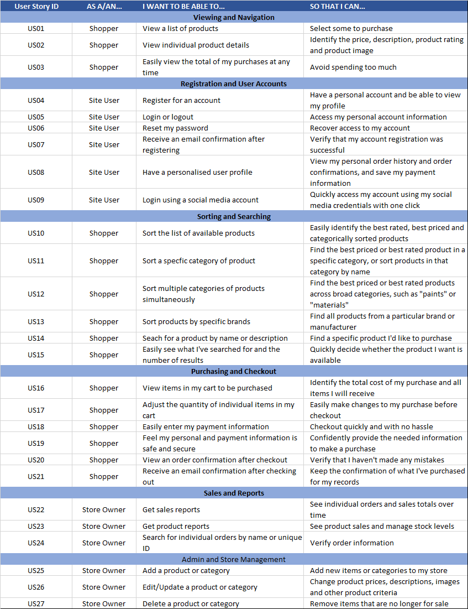
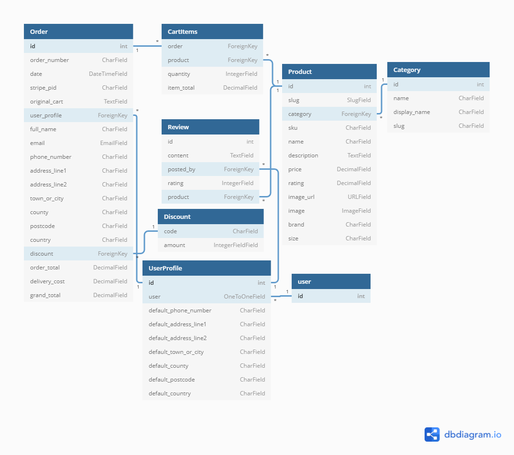

# Sleeping Dragon Hobby Shop

![Image]

### [See live site.]()

## Table of Contents

> -	[Overview](#overview)
> -	[Description](#description)
> -	[UX](#ux)
> -	[Features](#features)
> -	[Technologies Used](#technologies-used)
> -	[Testing](#testing)
> - [Deployment](#deployment)
> -	[Credits](#credits)
> - [Acknowledgements](#acknowledgements)

## Overview

Sleeping Dragon Hobby Shop is an e-commerce store for an existing company selling modelling and hobby supplies for wargaming, intended to replace the [current online presence](https://www.sleepingdragonhobbyshop.co.uk/) with a new web application. It also aims to reduce the company's reliance on third-party apps/plugins for site design and store management by providing internal control of those elements to site super users.  

## Description

## User Experience (UX)

### User stories
**User classes:**

- Site User - General user
- Shopper - A user wishing to purchase products
- Store Owner - Site super user

<table>
    <tr>
        <th>STORY ID</th>
        <th>AS A</th>
        <th>I WANT TO BE ABLE TO</th>
        <th>SO THAT I CAN</th>
    </tr>
    <tr>
        <td colspan="4"><b>Viewing and Navigation</b></td>
    </tr>
    <tr>
        <td>US01</td>	
        <td>Shopper</td>	
        <td>View a list of products</td>	
        <td>Select some to purchase</td>
    </tr>
    <tr>
        <td>US02</td>
        <td>Shopper</td>
        <td>View a specific category of products</td>
        <td>Quickly find products I'm interested in without having to search through all products</td>
    </tr>	
    <tr>
        <td>US03</td>
        <td>Shopper</td>
        <td>View individual product details</td>
        <td>Identify the price, description, product rating and product image</td>
    </tr>
    <tr>
        <td>US04</td>
        <td>Shopper</td>
        <td>Easily view the total of my purchases at any time</td>
        <td>Avoid spending too much</td>
    </tr>
    <tr>
        <td colspan="4"><b>Registration and User Accounts</b></td>
    </tr>
    <tr>
        <td>US05</td>
        <td>Site User</td>
        <td>Register for an account</td>
        <td>Have a personal account and be able to view my profile</td>
    </tr>
    <tr>
        <td>US06</td>
        <td>Site User</td>
        <td>Login or logout</td>
        <td>Access my personal account information</td>
    </tr>
    <tr>
        <td>US07</td>
        <td>Site User</td>
        <td>Reset my password</td>
        <td>Recover access to my account</td>
    </tr>
    <tr>
        <td>US08</td>
        <td>Site User</td>
        <td>Receive an email confirmation after registering</td>
        <td>Verify that my account registration was successful</td>
    </tr>
    <tr>
        <td>US09</td>
        <td>Site User</td>
        <td>Have a personalised user profile</td>
        <td>View my personal order history and order confirmatons, and save my payment information</td>
    </tr>
    <tr>
        <td>US10</td>
        <td>Site User</td>
        <td>Login using a social media account</td>
        <td>Quickly access my account using social media credentials with one click</td>
    </tr>
    <tr>
        <td colspan="4"><b>Sorting and Searching</b></td>
    </tr>
    <tr>
        <td>US11</td>
        <td>Shopper</td>
        <td>Sort the list of available products</td>
        <td>Easily identify the best rated, best priced and categorically sorted products</td>
    </tr>
    <tr>
        <td>US12</td>
        <td>Shopper</td>
        <td>Sort a specific category of products</td>
        <td>Find the best priced or best rated product in a specific category, or sort products in that category by name</td>
    </tr>
    <tr>
        <td>US13</td>
        <td>Shopper</td>
        <td>Sort multiple categories of products simultaneously</td>
        <td>Find the best priced or best rated products across broad categories, such as "paints" or "materials"</td>
    </tr>
    <tr>
        <td>US14</td>
        <td>Shopper</td>
        <td>Sort products by specific brands</td>
        <td>Find all products from a particular brand or manufacturer</td>
    </tr>
    <tr>
        <td>US15</td>
        <td>Shopper</td>
        <td>Search for a product by name or description</td>
        <td>Find a specific product I'd like to purchase</td>
    </tr>
    <tr>
        <td>US16</td>
        <td>Shopper</td>
        <td>Easily see what I've searched for and the number of results</td>
        <td>Quickly decide whether the product I want is available</td>
    </tr>
    <tr>
        <td colspan="4"><b>Purchasing and Checkout</b></td>
    </tr>
    <tr>
        <td>US17</td>
        <td>Shopper</td>
        <td>View items in my cart to be purchased</td>
        <td>Identify the total cost of my purchase and all items I will receive</td>
    </tr>
    <tr>
        <td>US18</td>
        <td>Shopper</td>
        <td>Adjust the quantity of individual items in my cart</td>
        <td>Easily make changes to my purchase before checkout</td>
    </tr>
    <tr>
        <td>US19</td>
        <td>Shopper</td>
        <td>Easily enter my payment information</td>
        <td>Checkout quickly and with no hassle</td>
    </tr>
    <tr>
        <td>US20</td>
        <td>Shopper</td>
        <td>Feel my personal and payment information is safe and secure</td>
        <td>Confidently provide the needed information to make a purchase</td>
    </tr>
    <tr>
        <td>US21</td>
        <td>Shopper</td>
        <td>View an order confirmation after checkout</td>
        <td>Verify that I haven't made any mistakes</td>
    </tr>
    <tr>
        <td>US22</td>
        <td>Shopper</td>
        <td>Receive an email confirmation after checkout out</td>
        <td>Keep the confirmation of what I've purchase for my records</td>
    </tr>
    <tr>
        <td colspan="4"><b>Sales and Reports</b></td>
    </tr>
    <tr>
        <td>US23</td>
        <td>Store Owner</td>
        <td>Get sales reports</td>
        <td>See individual orders and sales totals over time</td>
    </tr>
    <tr>
        <td>US24</td>
        <td>Store Owner</td>
        <td>Get product reports</td>
        <td>See product sales and manage stock levels</td>
    </tr>
    <tr>
        <td>US25</td>
        <td>Store Owner</td>
        <td>Search for individual orders by name or unique ID</td>
        <td>Verify order information</td>
    </tr>
    <tr>
        <td colspan="4"><b>Admin and Store Management</b></td>
    </tr>
    <tr>
        <td>US26</td>
        <td>Store Owner</td>
        <td>Add a product or category</td>
        <td>Add new items or categories to my store</td>
    </tr>
    <tr>
        <td>US27</td>
        <td>Store Owner</td>
        <td>Edit/Update a product or category</td>
        <td>Change product prices, descriptions, images and other product criteria</td>
    </tr>
    <tr>
        <td>US28</td>
        <td>Store Owner</td>
        <td>Delete a product or category</td>
        <td>Remove items that are no longer for sale</td>
    </tr>
</table>

## Structure

- ### Data Structure

## Skeleton

## Surface

### Images

### Colours

### Typography

### Icons

## Features

### Existing Features

### Features Left to Implement

## Technologies Used

#### Languages:

#### Libraries & Frameworks:

#### Version Control:

#### Other:

---

## Testing

## Deployment

### GitHub

### Heroku

### Forking the GitHub Repository

### Making a local Clone

## Credits

## Acknowledgements
