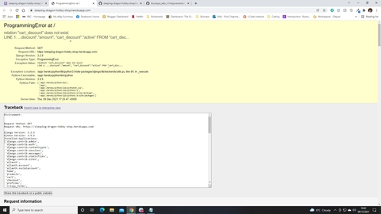

# Sleeping Dragon Hobby Shop - Testing 

## Contents 
- [Automated Testing](#automated-testing)
    - [HTML](#html)
    - [CSS](#css)
    - [JavaScript](#javascript)
    - [Python](#python)
    - [Python Unit Tests](#python-unit-tests)
    - [Automated Performance Testing](#automated-performance-testing)
- [Manual Testing](#manual-testing)
    - [Responsive Design Testing](#responsive-design-testing)
    - [Testing Environments](#testing-environments)
- [Project Bugs and Solutions](#project-bugs-and-solutions)
- [Known Issues](#known-issues)

## Automated Testing 

### HTML 
All **HTML** code was validated using the [W3C Markup Validation Service](https://validator.w3.org/) 
regularly during the development process. **The HTML Source Code** was regularly viewed for each page 
using **Chrome Developer Tools** (right click, *Inspect*) and passed through the 
[W3C Markup Validation Service](https://validator.w3.org/).  
Various minor errors were encountered and corrected during the final **HTML** validation check. 
All HTML code now passes validation with no errors or warnings. See [HTML Validation Reports](media/testing/validation/html).

### CSS
Custom CSS from [base.css](static/css/base.css), [profile.css](profiles/static/profiles/css/profile.css) and [checkout.css](checkout/static/checkout/css/checkout.css) was validated using the [W3C CSS Validation Service](https://jigsaw.w3.org/css-validator/).  
No errors were generated. See [CSS Validation Reports](media/testing/validation/css).

### JavaScript
The custom Javascript from [countryfield.js](profiles/static/profiles/js/countryfield.js), [stripe_elements.js](checkout/static/checkout/js/stripe_elements.js) and [quantity_input_script.html](products/templates/products/includes/quantity_input_script.html), as well as all script elements within app templates, were validated using the [JSHint](https://jshint.com/) static code analysis tool with no errors and only a few warnings, which were corrected before re-running the validation. See [JS Validation Reports](media/testing/validation/js). Due to the lack of complexity in the Javascript code, automated testing of the JavaScript code was deemed unnecessary. 

### Python
Pylint was used to verify **Python** code. Any errors were corrected and re-run until correct. In some cases, where linting errors were erroneous or unavoidable these were suppressed (most commonly 'E1101: Class has no objects member'). Files generated by django and unit tests were ignored.

<em>E1101</em> (no-member) errors are ignored for all apps, as Django dynamically adds 'objects' Manager instance to all models, but pylint is unable to detect this. This warning could be avoided by adding a `objects = models.Manager()` declaration to all models, but I have elected to suppress the warning rather than add unnecessary code to the application.
<em>R0903</em> (too-few-public-methods) error ignored for .forms as all forms are designed to store information, populate the database, allow users to edit database entries, and iterate through form data in templates.

<em>W0613</em> (unused-argument) errors ignored for profiles.models as arguments are necessary for creation of user profiles in the Django admin.

<em>R0201</em> (no-self-user) error ignored for checkout.models generate_order_number method, as self is necessary to attach the generated order number to the particular Order instance
<em>W0613</em> (unused-argument) errors ignored for checkout.signals as arguments are necessary for updating order total when updating and removing lineitems in the shopping cart.
<em>W0125</em> (using-constant-test) error ignored for checkout.views as value is not actually a constant.
<em>R0914</em> (too-many-locals) error ignored for checkout.views and checkout.webhook_handler as both methods in question are adapted from the Stripe documentation
<em>W0703</em> (broad-except) error in checkout.views, checkout.webhook_handler and checkout.webhooks ignored as specific error handling is implemented where necessary, and other errors are handled in the same way so extra code for more specific exceptions would be redundant.

See [Pylint Validation Reports](media/testing/validation/python).

### Python Unit Tests

Automated unit tests were created to ensure correct functioning of various components. These include the app database models, views, forms and signal functions.
To perform automated testing, from the project root directory type:
`>python3 manage.py test`

A total of **68** **Unit Tests** have been written. After **Unit Testing** was implemented, **Unit Tests** were run each time a feature was added or changed.  
All **68** tests run successfully without errors or warnings, see [Python Unit Testing Validation](media/testing/validation/python/unit-testing-val.jpg).

### Automated Performance Testing

Performance and Quality was tested with the [Lighthouse](https://chrome.google.com/webstore/detail/lighthouse/blipmdconlkpinefehnmjammfjpmpbjk?hl=en) 
extension for [Google Chrome](https://www.google.com/intl/en_uk/chrome/).

To improve **Accessibility** and **SEO**, missing *rel="noopener"* and *aria-label* attributes were added to the some of the buttons and links in the **HTML Templates**. *meta description* was added to the head element to improve **SEO**. Heading elements were adjusted to appear in sequentially-descending order to improve **Accessibility**. Form inputs had *label* elemtents added where necessary to improve **Accessability**.

To improve **Best Practices** and **Performance**, images were resized to 300px x 300px and compressed. Performance could be improved further by converting images to a next-gen format like WebP; however, due to the time constraints of the project this would need to be done as part of a future development phase, as the fixture files currently all refer to .png or .jpg image filepaths and converting images to WebP would also require changing every image filepath. Due to the sheer amount of products and associated images, **Performance** is heavily dependent on how many images the site is required to load. Upgrading the server to use HTTP/2 would drastically improve **Performance** scores, but is beyond the scope of this project. However, this is mitigated somewhat by the fact that, although users *can* browse all products at once, it is highly unlikely that the typical user would utilise the site in this way rather than using the specific navigation menus and search functionality. 

Final [Lighthouse](https://chrome.google.com/webstore/detail/lighthouse/blipmdconlkpinefehnmjammfjpmpbjk?hl=en) scores are tabulated below:  

Page|Performance|Accessiblity|Best Practices|SEO|
----|-----------|------------|--------------|---|
Home|99|97|100|100
Products|63*|98|100|100
Product Detail|98|97|93|100
Product Add|97|97|100|100
Product Edit|97|98|100|100
Product Review|99|97|100|100
Cart|99|96|100|100
Checkout|92|98|100|100
Checkout Success|97|98|100|100
Login|97|97|100|100
Logout|99|97|100|100
Register|98|97|100|100
User Profile|96|97|100|100
Order History|98|98|100|100
Product Management|98|97|100|89*

* As noted, performance on the Products page is severely impacted by the sheer quantity of images, as there are over 500 products loading. While it may not have been the best approach to use this much data for the purposes of this project, it is a truer reflection of the size of an existing ecommerce database. Due to the timescale of this project, the size of the dataset and the necessary steps to resolve, it is not feasible to implement further improvements at this point in development, but should be addressed in a future development phase especially if the application is adopted in place of the existing business site.
* The SEO score for the Product Management page is much lower than any other page on the site due to the lack of a *href* attribute on the #delete-category-btn element. As the *href* is dynamically added with the use of a JavaScipt script dependent on the selector value, and also because the Product Management page is only accessible to admin users (and thus would not be accessible directly from search engine results) I do not consider this lower score to be an issue. 

See [Final Lighthouse Reports](media/testing/validation/performance).

### Mobile Friendly Tests

Ensured the website was also responsive on all pages through [Google Mobile Friendly Test](https://search.google.com/test/mobile-friendly).

<b>Mobile Friendly Test</b>

[Mobile Friendly Tests](media/testing/validation/mobile-friendly-tests)

## Manual Testing

* Forms testing: to ensure the forms were functioning as they should, I tested each of the forms on different devices and browsers. This was done by iterating through each of the required form fields and attempting to submit without a text input to make sure they resulted in the desired response of 'Please fill out this field'. Each 'required' input was tested individually on all forms to ensure the validation responded appropriately each time. 

* Further forms testing was conducted for Integer and Decimal fields by attempting to enter invalid values, either outside of the accepted range or with an incorrect number of decimals to confirm that the field resulted in the desired response (either stating that the value was invalid, or was outside the accepted range). 

* Quantity input forms on the product detail and cart pages were tested by attempting to forcibly add products above their stock level, by clicking the increase-qty buttons, clicking the input field selector and also by manually entering an excessive quantity. Each of these resulted in the correct response and prevented cart quantity exceeding the product stock quantity, displaying the correct warning to users.

* Links (Internal & External): Each of the links when clicked have been checked so that the user is directed to the desired location. For a better UX experience, all external links included a target="_blank" attribute so that a new browser tab is opened when clicked. <b>It should be noted that the footer policy links currently do not redirect users to the stated locations, but instead direct back to the home page - these will be added in a future development phase.</b>

* Manual testing was conducted to test functions and database entry submissions. In this way most bugs were caught and fixed before they were committed to the repository or live site. The python print() and JavaScript console.log functions were used to output variable values and breakpoints during development to give hints to where faults were occurring and why.

* Admin-only access was tested by attempting to gain access to admin-only pages with a non-admin test account, by manually entering the url into the address bar. These tests all resulted in the desired result, displaying an error message to the user ('Sorry, only store owners can do that') and redirecting the user to the previous page. 

* Authenticated access was tested in the same way, by attempting to access those features that are restricted to registered users (User Profile, Order History, Review Product). These successfully redirect unregistered users to the login page.

* The Stripe payment system was thoroughly tested to ensure all checkouts worked as expected. This was done using the Stripe API test keys and the test card numbers provided to simulate successful, authentication required and failed checkouts. Stripe webhooks were tested to ensure the correct response was received, and the app views were testing to ensure each of them functioned as expected, including generating order confirmations, sending confirmation emails, saving user delivery information to user profile (for registered users) and populating order history with the correct data. Test were also run to simulate form submission errors by commenting out code; these resulted in the appropriate webhook response and the order being created in the database by the webhook as expected. 

### Responsive Design Testing

Responsive design has been tested by using Chrome DevTools to emulate viewing the website on a number of devices with varying screen dimensions, including iPhone 5/SE, iPhone 6/7/8, iPhone 6/7/8 plus, iPhone 11, iPad, iPad Pro, Moto G4, Galaxy S5, Surface Duo, Galaxy Fold, Widescreen Laptop and Desktop PC. The site was tested on screen widths from 280px up to 1920px.

Responsive design was then further tested using the [Responsive Viewer](https://chrome.google.com/webstore/detail/responsive-viewer/inmopeiepgfljkpkidclfgbgbmfcennb/related?hl=en) plugin for Chrome. This emulates viewing the website on a large number of devices, including iPhone XR, iPhone XS Max, iPhone XS, iPhone X, Galaxy S9 Plus, Galaxy S8 Plus, Galaxy S9, Note 8, Note S8, Pixel 3 and Pixel 3XL.

### Testing Environments
Primary testing was undertaken on a Windows 10 desktop machine with the Google Chrome browser. 

**Desktop testing**

- Platforms:
  - Custom Desktop (Windows 10)
  - ASUS E410MA Laptop (Windows 10)
- Browsers:
  - Google Chrome
  - Microsoft Edge
  - Firefox
  - Opera
  - Safari

**Tablet testing**

- Platforms:
  - Samsung Tab A6 (Android 10)
  - Samsung Tab A4 (Android 10)
  - iPad Pro 12.9 2020 (IOS 14)
- Browsers:
  - Google Chrome
  - Firefox
  - Safari

**Mobile testing**

- Platforms:
  - Samsung Galaxy S8 (Android 10)
  - Samsung Galaxy A42 (Android 10)
  - iPhone 12 Pro (IOS 14)
  - iPhone 11 (IOS 14)
- Browsers:
  - Chrome
  - FireFox
  - Safari

## Project Bugs and Solutions

* The increase-qty button on **Product Detail** pages were set to a max-value equal to the product stock; however, the input field itself was still allowing users to select a quantity greater than the product stock value. This issue was solved by changing the max-value of the input to `{{ product.stock }}` so that it dynamically adapted to the stock level of each product.
* Following the previous issue, after testing it became that this did not prevent users adding products to the cart multiple times to exceed the product stock value, or from navigating to the cart page and updating the item quantity to a greater value. This was addressed by updating the Cart app views logic (add_to_cart and adjust_cart) so that they checked the cart item quantity against the product stock before updating/adding the product to the cart. Now users are prevented from adding more to their cart than are in stock, with an error message displayed to inform users that no more of that product can be added.
* During development several automatic Heroku deployments failed and generated a Programming Error in the app:

This was caused by database migrations being out of sync between GitPod and Heroku. Thanks to [this thread](https://stackoverflow.com/questions/48083216/django-on-heroku-programmingerror-at-relation-does-not-exist) on Stack Overflow, I was able to run `heroku run manage.py migrate` and fix the issue. 

## Known Issues

None known.